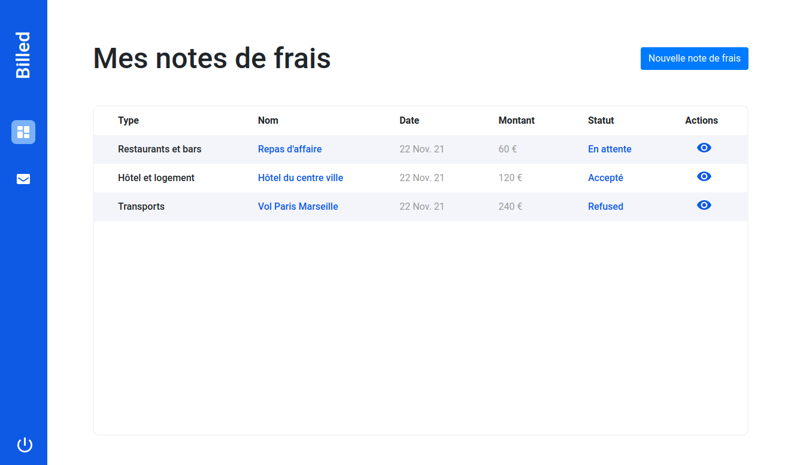

[](https://nodejs.org/)


# oc-p9-billed
This project is the n°9 in the [OpenClassrooms Front-End learning path](https://openclassrooms.com/fr/paths/516-developpeur-dapplication-javascript-react).

I'm a front-end developer at **Billed**, a company that produces Saas solutions for human resources teams. I'm working on setting up tests on the "expense report" feature:
- debug the administrator path
- debug and test the employee journey

## ✨ Screenshot


## 🛠️ Installation
See more on back and front READMEs.

```
cd Billed-app-FR-Back
npm install
cd ../Billed-app-FR-Front
npm install
npm install -g live-server
```

## 🚀 Usage

**Back**
```
cd Billed-app-FR-Back
npm run dev
```

**Front**
```
cd Billed-app-FR-Front
live-server
```

## 👤 Author
- [@jeromeabel](https://github.com/jeromeabel)
- OpenClassrooms-Center

## 📝 License
- Nope!